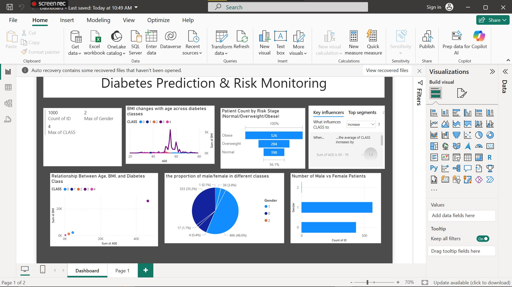

---

## Python Analytics Tasks

### 1. Data Cleaning
- Checked for missing values and handled them by imputing with mean values.
- Encoded categorical variables (Gender and CLASS) into numeric format.
- Removed duplicate records.

### 2. Exploratory Data Analysis (EDA)
- Generated summary statistics (mean, median, std).
- Visualized distributions using histograms, scatter plots, and count plots.
- Correlation heatmap to identify relationships between features.

### 3. Machine Learning Models
- Built classification models to predict diabetes status:
  - Logistic Regression
  - Random Forest Classifier
- Trained models on 80% of the data and tested on 20%.

### 4. Model Evaluation
- Used accuracy score, precision, recall, and F1-score.
- Visualized confusion matrices to identify false positives/negatives.
- Examined feature importance from Random Forest to understand key predictors.

### 5. Clustering Analysis
- Applied KMeans clustering to segment patients based on scaled features.
- Visualized clusters on Age vs BMI to discover natural groupings.

---

## Power BI Dashboard

- Created an interactive dashboard summarizing data insights.
- Visuals include:
  - KPI cards showing key metrics (average age, % diabetic, etc.)
  - Pie charts for gender and diabetes class distribution
  - Bar charts for feature distributions
  - Line charts to observe trends
  - Scatter plots to explore relationships
  - Funnel charts to show patient risk stages (using BMI categories)
- Incorporated slicers and filters for interactivity.
- Applied consistent color themes and clear labeling for usability.

---

## How to Run

1. Clone or download this repository.
2. Open `data_cleaning_and_analysis.ipynb` in Jupyter Notebook and run all cells.
3. Open `diabetes_dashboard.pbix` in Power BI Desktop to explore the dashboard.
4. Use the slicers in Power BI to interact with the data visuals.

---

## Recommendations

- Regular monitoring of high-risk patients based on BMI and blood markers.
- Use the predictive model to support early intervention for diabetes prevention.
- Future work can include more data sources and advanced modeling techniques.

---

## Screenshots

## Screenshots

### Loading Data

### Using Dax to add New Columns

### Dashboard

---

## License

This project is for academic purposes only.

